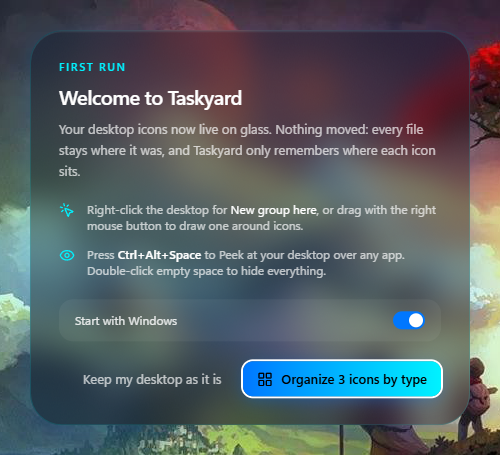
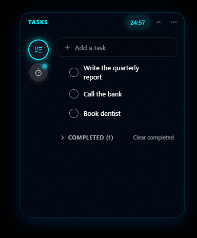
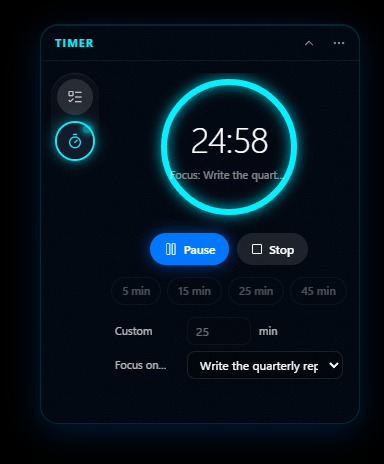
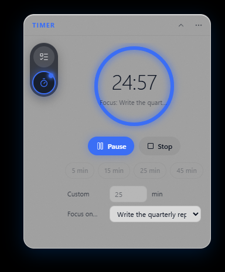

# Taskyard

A Fences-style desktop organizer for Windows 11. Taskyard sits on the desktop layer, paints your
wallpaper and shows every Desktop item — loose like the real desktop, or inside named glass
groups you can move, resize, roll up and quick-hide. A floating tools widget holds a to-do list
and a focus timer.

**[⬇ Download Taskyard for Windows 11 (x64)](https://github.com/Divici/Taskyard/releases/latest/download/Taskyard-0.1.0-setup.exe)**
· [All releases](https://github.com/Divici/Taskyard/releases)

<p>
  
  
  
  
</p>

## What it does

- **Groups on the desktop.** Right-drag on the desktop (or right-click › New group here) to draw a
  named glass group. Move, resize, rename, roll it up to its title bar, sort it, or delete it —
  deleting a group never deletes files.
- **Drag and drop.** Move one or many icons between groups and the desktop, drop files from
  Explorer (with a 6-second Undo), or drag icons out to other apps.
- **Quick-hide and Peek.** Double-click empty desktop to hide everything; press the Peek shortcut
  to bring your groups above whatever app is open.
- **To-do list and focus timer.** A floating glass widget with a side rail: add, edit, check off
  and reorder tasks; start, pause and stop a countdown linked to a task, with a Windows notification
  when it ends.
- **Your look.** Follows the Windows light/dark theme (or pick one), with sliders for glass opacity
  and blur, accent colours, icon size, and a reduced-motion switch.
- **Saves itself.** Layout, tasks and settings are saved automatically and restored at sign-in;
  multi-monitor layouts survive monitors being unplugged and plugged back in.

## Download and install

1. Download **[Taskyard-0.1.0-setup.exe](https://github.com/Divici/Taskyard/releases/latest/download/Taskyard-0.1.0-setup.exe)**.
2. Run it. The installer is not code-signed, so Windows SmartScreen may say _"Windows protected
   your PC"_ — click **More info › Run anyway**.
3. Taskyard starts and appears in the tray. Right-click the tray icon for Settings, Peek and Quit.

Runs on Windows 11 (22H2 or later), x64. No admin rights, Node or other downloads needed.

## How it's built

Electron and React for the UI, with a thin layer of Win32 calls (through the `koffi` FFI library)
that keeps one opaque window per monitor seated directly above Windows' own desktop window —
through clicks, Win+D and Explorer restarts. The glass is real blur over Taskyard's own copy of
your wallpaper, so it stays smooth while dragging. Files are tracked by NTFS file id, so renames in
Explorer keep their placement, and every save is versioned, validated and written atomically.
The full plan, research and decision log are in [`docs/plans/`](docs/plans/2026-09-21-taskyard/plan.md).

- **Files never move.** The layout is metadata keyed by NTFS file id, so renames in Explorer keep
  their place and Explorer, other apps and Taskyard always agree about where a file is.
- **Real glass.** Groups blur Taskyard's own copy of the wallpaper (CSS `backdrop-filter`), so the
  glass holds 60 fps while dragging and is independent of Battery Saver.
- **Lightweight.** One window per monitor, seated just above the shell's desktop window; no
  telemetry, no auto-update, no cloud.

For how to use it, see [docs/USER_GUIDE.md](docs/USER_GUIDE.md).

## Installer details

`Taskyard-<version>-setup.exe` is a one-click, per-user installer:
no admin prompt, installed to `%LOCALAPPDATA%\Programs\taskyard`, with a Start menu shortcut (no
desktop shortcut) and Taskyard started when it finishes (a silent `/S` install does not start it). Taskyard runs from the tray (no taskbar
button) and starts with Windows unless you turn that off.

Uninstall from **Settings › Apps › Installed apps › Taskyard**. Uninstalling removes the program,
its Start menu shortcut and its Start with Windows entry. Your layout, tasks and settings stay in
`%APPDATA%\Taskyard` so a reinstall picks them up; delete that folder to remove them too.

Requirements: Windows 11 (22H2 or later), x64.

## Build from source

Node 24 and npm.

```
npm install
npm run dev          # the app with hot reload (electron-vite)
npm run dist         # dist/Taskyard-<version>-setup.exe and dist/win-unpacked/
```

`npm install` must run install scripts: Electron downloads its binary in its own `install.js`.

## Tests and checks

| Command                         | What it runs                                                                                                                                                                                 |
| ------------------------------- | -------------------------------------------------------------------------------------------------------------------------------------------------------------------------------------------- |
| `npm run typecheck`             | `tsc` for main/preload/scripts and for the renderer                                                                                                                                          |
| `npm run lint`                  | ESLint + Prettier, zero warnings allowed                                                                                                                                                     |
| `npm test`                      | vitest: main (node) and renderer (jsdom) — headless, runs anywhere                                                                                                                           |
| `npm run test:win32`            | the real-Win32 unit tests (opt-in, interactive Windows)                                                                                                                                      |
| `npm run test:e2e:win`          | Playwright against the built app (interactive Windows session)                                                                                                                               |
| `npm run verify:koffi`          | the packaged exe loads koffi's native binary                                                                                                                                                 |
| `npm run verify:zorder`         | the desktop layer stays seated through Win+D, Explorer restarts and auto-hide taskbars; `-- --packaged` runs it against `dist/win-unpacked/Taskyard.exe`, `-- --exe <path>` against any copy |
| `npm run perf:fixture <folder>` | writes the 200-item performance fixture (150 `.lnk`) into an empty folder                                                                                                                    |

Every interactive test runs with a throwaway profile and a temp desktop folder
(`TASKYARD_USER_DATA`, `TASKYARD_DESKTOP_DIRS`); none of them reads or changes your real desktop.

### Performance (measured, `e2e/perf.spec.ts`)

On the fixture (12 groups, 200 items, 150 shortcuts), this machine (Windows 11 25H2, 2560×1440 at
240 Hz + 1920×1080):

| Budget                                                     | Measured                            |
| ---------------------------------------------------------- | ----------------------------------- |
| Desktop scan ≤ 300 ms                                      | 24–30 ms                            |
| Warm startup-to-icons ≤ 1.5 s                              | 0.36–0.39 s                         |
| Cold startup-to-icons (reported)                           | 0.71–0.86 s (icon pass 0.51–0.60 s) |
| p95 frame time ≤ 18 ms over a 3 s group drag (during Peek) | 16.7 ms (median 4.2 ms at 240 Hz)   |

## Environment variables

| Name                    | Effect                                                                     |
| ----------------------- | -------------------------------------------------------------------------- |
| `TASKYARD_DESKTOP_DIRS` | semicolon-separated folders scanned instead of the Desktop folders (tests) |
| `TASKYARD_USER_DATA`    | overrides the data folder (`%APPDATA%\Taskyard`)                           |
| `TASKYARD_NO_WIN32`     | `1` runs with the Win32 fake (no z-order seating)                          |
| `TASKYARD_LOG_LEVEL`    | log level for `logs/main.log`                                              |

## Stack

Electron 44 + koffi 3 (Win32 through FFI), React 19, TypeScript (strict), electron-vite 5,
Tailwind CSS 4, shadcn/ui, zustand 5, zod 4, dnd-kit, vitest 3, Playwright 1.63,
electron-builder 26 (NSIS).

## Data

`%APPDATA%\Taskyard`: `layout.json`, `tasks.json`, `settings.json`, `ops.json` (the move journal),
`icons/` (icon cache) and `logs/`. Every file is versioned JSON, validated on load and written
atomically; a corrupt file is set aside and restored from its `.bak`.
